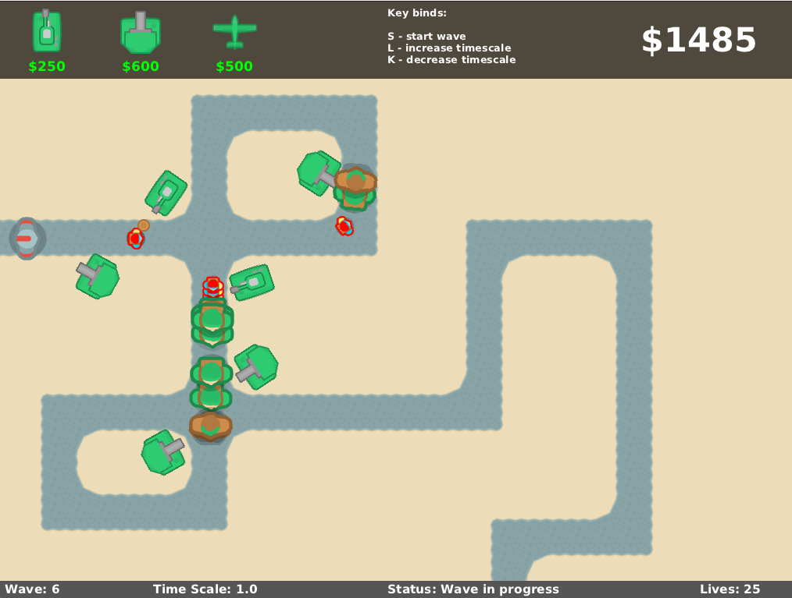

<h1 align="center"> Tower Defence Game</h1>
 

  
  
  

<h3 align="center">Tower Defence Game</h3>

A basic tower defence strategy game created using Java and lwjgl.

## How to play

### Overview

- The game starts with 25 Life points and $500.
- Begin by placing a defence on the map. Defences cannot be placed on the pathway.
- Once you have finished preparing press 'S' to start the wave.
- Defences can be placed while the wave is in progress.
- When a wave is complete you will be able to prepare again before pressing 'S' to start a new wave.
- Waves get progressively harder with more enemies at once.
- There are 7 waves per level and 3 levels

### Key Bindings

| Key | Action          |
| --- | --------------- |
| S   | Starts the wave |
| L   | Speeds up time  |
| K   | Slows down time |

### Defences - Buy Menu

| Defence                                  | Projectile                                                  | Damage(HP) | Fire Rate(ps)                  | Effect Radius(units) | Cost($) |
| ---------------------------------------- | ----------------------------------------------------------- | ---------- | ------------------------------ | -------------------- | ------- |
|              |            | 1          | 1                              | 100                  | $250    |
|    |  | 3          | 2                              | 150                  | $600    |
|  |             | 500        | One Explosive Dropped Randomly | 200                  | $500    |

### Enemies

| Enemy                                      | Name           | Health Points | Speed        | Kill Reward | Lives Penalty | Spawns            |
| ------------------------------------------ | -------------- | ------------- | ------------ | ----------- | ------------- | ----------------- |
|     | Regular Slicer | 1 HP          | 2 units/s    | $2          | 1 Life        | ~                 |
|  | Super Slicer   | 1 HP          | 1.5 units/s  | $15         | 2 Lives       | 2 Regular Slicers |
|    | Mega Slicer    | 2 HP          | 1.25 units/s | $10         | 4 Lives       | 2 Super Slicers   |
|    | Apex Slicer    | 25 HP         | 0.75 units/s | $150        | 16 Lives      | 4 Mega Slicers    |

## Build Steps

### Install Java

This Game uses Java 8 so it will need to be installed

### Install Maven - A Java Package Manager

Instructions to install maven can be found [here](https://maven.apache.org/install.html)
on mac `brew install maven`

### install custom library

`mvn install:install-file -Dfile=lib/bagel-1.9.2.jar -DgroupId=unimelb -DartifaceId=bagel -Dversion=1.9.2 -Dpackaging=jar`

This is a wrapper around lwjgl - a lightweight java game library - found [here](https://gitlab.eng.unimelb.edu.au/emcmurtry/bagel-public)

### Install Dependencies and compile source code

| os                  | command                                    |
| ------------------- | ------------------------------------------ |
| macos intel         | `mvn install -P lwjgl-natives-macos`       |
| macos apple silicon | `mvn install -P lwjgl-natives-macos-arm64` |
| windows             | `mvn install -P lwjgl-natives-windows`     |
| linux               | `mvn install -P lwjgl-natives-linux`       |

### Run

`mvn exec:exec`
